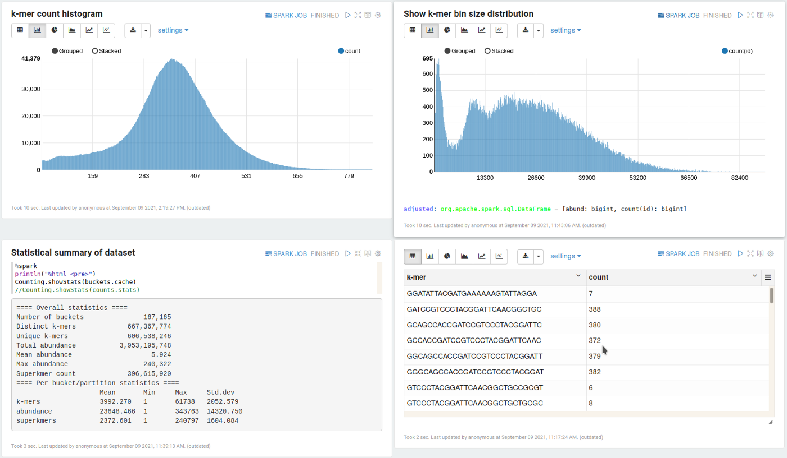

## Discount

Discount is a Spark-based tool for k-mer (genomic sequences of length k) counting and analysis. 
It is able to analyse large metagenomic-scale datasets while having a small memory footprint. 
It can be used as a standalone command line tool, but also as a general Spark library, including in interactive 
notebooks.

Discount aims to be an extremely scalable k-mer counter for Spark/HDFS.
It has been tested on the [Serratus](https://serratus.io/) dataset for a total of 5.59 trillion k-mers (5.59 x 10^12) 
with 1.57 trillion distinct k-mers.

This software includes [Fastdoop](https://github.com/umbfer/fastdoop) by U.F. Petrillo et al [1].
We have also included compact universal hitting sets generated by [PASHA](https://github.com/ekimb/pasha) [2].
 
For a detailed background and description, please see 
[our paper on evenly distributed k-mer binning](https://academic.oup.com/bioinformatics/advance-article/doi/10.1093/bioinformatics/btab156/6162158).

## Contents
1. [Basics](#basics)
    - [Running Discount](#running-discount)
    - [K-mer counting](#k-mer-counting)
    - [Interactive notebooks](#interactive-notebooks)
    - [Use as a library](#use-as-a-library)
    - [Tips](#tips)
2. [Advanced topics](#advanced-topics)
    - [Minimizers](#minimizers)
    - [Generating a universal hitting set](#generating-a-universal-hitting-set)
    - [Evaluation of minimizer orderings](#evaluation-of-minimizer-orderings)
    - [Performance tuning for large datasets](#performance-tuning-for-large-datasets)
    - [Compiling Discount](#compiling-discount)
    - [Citation](#citation)
    - [Contributing](#contributing)
3. [References](#references)

## Basics

[Compiling](#compiling-discount) is optional. If you prefer not to compile Discount yourself, 
you can download a pre-built release from the [Releases](https://github.com/jtnystrom/Discount/releases) page.

### Running Discount

Discount can run locally on your laptop, on a cluster, or in the cloud.
It has been tested standalone with Spark 3.1.0, and also on AWS EMR and on Google Cloud Dataproc.

To run locally, download the Spark distribution (3.0 or later) (http://spark.apache.org).

Scripts to run Discount are provided for macOS and Linux. To run locally, copy `spark-submit.sh.template` to a new file 
called `spark-submit.sh` and edit the necessary variables in the file (at a minimum, set the path to your unpacked Spark
distribution). This will be the script used to run Discount. It is also very helpful to point `LOCAL_DIR` to a fast 
drive, such as an SSD.

To run on AWS EMR, you may use `submit-aws.sh.template`. In that case, change the example commands below to
use that script instead, and insert your EMR cluster name as an additional first parameter when invoking. To run on 
Google Cloud Dataproc, please use `submit-gcloud.sh.template` instead.

### K-mer counting

The following command produces a statistical summary of a dataset.
 
`
./spark-submit.sh -k 55 /path/to/data.fastq stats
`

All example commands shown here accept multiple input files. The FASTQ and FASTA formats are supported,
and must be uncompressed.

To submit an equivalent job to AWS EMR, after creating a cluster with id j-ABCDEF1234 and uploading the necessary files
(the GCloud script `submit-gcloud.sh` works in the same way):

`
./submit-aws.sh j-ABCDEF1234 -k 55 
my-data/path/to/data.fastq stats
`

As of version 2.3, minimizer sets for k >=19, m=10,11 are bundled with Discount and do not need to be specified
explicitly. Advanced users may wish to override this ([see the section on minimizers](#minimizers))

To generate a full counts table with k-mer sequences (in many cases larger than the input data),
the `count` command may be used:

`
./spark-submit.sh -k 55 /path/to/data.fastq count -o /path/to/output/dir --sequence
`

A new directory called `/path/to/output/dir_counts` (based on the location specified with `-o`) will be created for the 
output.

Usage of upper and lower bounds filtering, histogram generation, normalization of
 k-mer orientation, and other functions, may be seen in the online help:

`
./spark-submit.sh --help
`

#### Chromosomes and very long sequences

If the input data contains sequences longer than 1,000,000 bp, you must use the `--maxlen` flag to specify the longest
expected single sequence length. However, if the sequences in a FASTA file are very long (for example full chromosomes),
it is essential to generate a FASTA index (.fai). Various tools can be used to do this, for example with 
[SeqKit](https://github.com/shenwei356/seqkit):

`
seqkit faidx myChromosomes.fasta
`

Discount will detect the presence of the `myChromosomes.fasta.fai` file and read the data efficiently. In this case, 
the parameter `--maxlen` is not necessary.

#### Repetitive or very large datasets

As of version 2.3, Discount contains two different counting methods, the "simple" method, which was the only method 
prior to this version, and the "pregrouped" method, which is essential for data that contains highly repetitive k-mers.
Discount will print a message at startup showing the method used (a very basic heuristic is used, so we would advise 
users to do their own experiments). If Discount crashes with a Spark exception about buffers being too large, the 
pregrouped method may help. For example, to force the pregrouped method to be used:

`
./spark-submit.sh --method pregrouped -k 55 /path/to/data.fastq stats
`

Or, to force the simple method to be used:

`
./spark-submit.sh --method simple -k 55 /path/to/data.fastq stats
`

While highly scalable, this method may sometimes cause a slowdown overall (by requiring one additional shuffle), so it 
should not be used for datasets that do not need it. See the section on [performance tuning](#performance-tuning-for-large-datasets).

### Interactive notebooks
Discount is well suited for data analysis in interactive notebooks, and as of version 2.0 the API has been 
redesigned with this in mind. A demo notebook for [Apache Zeppelin](https://zeppelin.apache.org/) is included in the 
`notebooks/` directory. It has been tested with Zeppelin 0.10 and Spark 3.1.
To try this out, after downloading the Spark distribution, also [download Zeppelin](https://zeppelin.apache.org/).  
(The smaller "Netinst" distribution is sufficient, but an external Spark is necessary.)
Then, load the notebook itself into Zeppelin through the browser to see example use cases and instructions.

### Use as a library
You can add Discount as a dependency using the following syntax (SBT):

`
 libraryDependencies += "com.jnpersson" %% "discount" % "2.3.0"
`

API docs for the current release are [available here](https://jtnystrom.github.io/Discount/com/jnpersson/discount/spark/index.html).
Please note that Discount is still under heavy development and the API may change slightly even between minor versions.

### Tips
* Visiting http://localhost:4040 (if you run a standalone Spark cluster) in a browser will show progress details while
  Discount is running.
  
* If you are running a local standalone Spark (everything in one process) then it is helpful to increase driver memory 
as much as possible (this can be configured in spark-submit.sh). Pointing LOCAL_DIR to a fast drive for temporary data 
  storage is also highly recommended.
  
* The number of files generated in the output tables will correspond to the number of partitions Spark uses, which you 
  can configure in the run scripts. However, we recommend configuring partitions for performance/memory usage 
  (the default value of 200 is usually fine) and manually joining the files later if you need to.

## Advanced topics 

### Minimizers

Discount counts k-mers by constructing super k-mers (supermers) and shuffling these into bins. Each bin corresponds to 
a minimizer, which is the minimal m-mer for some m < k in each k-mer, for some ordering of a minimizer set.
The choice of minimizer set and ordering does not affect k-mer counting results, but can have a big effect on performance. 
By default, Discount will use internal minimizers, which are packaged into the jar from the [resources/PASHA](resources/PASHA) 
directory. These are universal hitting sets, available for k >= 19, m=9,10,11. 
By default, they will be ordered by sampled frequency in the dataset being analysed, prioritising uncommon minimizers 
over common ones.

We provide some additional minimizer sets at
https://jnpsolutions.io/minimizers. You can also generate your own set using PASHA (described below).

To manually select a minimizer set, it is possible to point Discount to a file containing a set, or to a directory 
containing minimizer sets. For example:

`
./spark-submit.sh -m 10 --minimizers resources/PASHA/minimizers_55_10.txt -k 55 /path/to/data.fastq stats
`

In this case, minimizers have length 10 (m=10) and the supplied minimizer set will work for any k >= 55.

If you instead supply a directory, the best minimizer set in that directory will be chosen automatically,
by looking for files with the name minimizers_{k}_{m}.txt:

`
./spark-submit.sh -m 10 --minimizers resources/PASHA -k 55 /path/to/data.fastq stats
`

It is also possible (but less efficient ) to operate without a minimizer set, in which case all m-mers will become 
minimizers.  This can be done using the `--allMinimizers` flag. Currently, this flag is must be used when k < 19 as we 
do not supply minimizer sets in that range:

`
./spark-submit.sh -k 17 --allMinimizers /path/to/data.fastq stats
`

### Generating a universal hitting set

For optimal performance, compact universal hitting sets (of m-mers) should be used as minimizer sets.
They may be generated using the [PASHA](https://github.com/ekimb/pasha) tool.
Precomputed sets for many values of k and m may also be downloaded from the 
[PASHA website](http://pasha.csail.mit.edu/).
(Note that the PASHA authors use the symbols (k, L) instead of (m, k), which we use here. 
Their k corresponds to minimizer length, which we denote by m.)

A universal set generated for some pair of parameters (k, m) will also work for a larger k. However, the larger the gap, 
the greater the number of bins generated by Discount and the shorter the superkmers would be. This can negatively impact 
performance.

Computed sets must be combined with their corresponding decycling set (available at the link above), 
for example as follows:

`
cat PASHA11_30.txt decyc11.txt > minimizers_30_11.txt
`

This produces a set that is ready for use with Discount.

### Evaluation of minimizer orderings

Discount can be used to evaluate the bin distributions generated by various minimizer orderings.
See [docs/Minimizers.md](docs/Minimizers.md) for details.

### Performance tuning for large datasets

The philosophy of Discount is to achieve performance through a large number of small and evenly sized bins, 
which are grouped into a large number of modestly sized Spark partitions. This reduces memory pressure as well as CPU 
time for many of the algorithms that need to run. For most datasets, the default settings should be fine.
However, for huge datasets or constrained environments, the pointers below may be helpful.

1. Increase m. For very large datasets, with e.g. more than 1011 total k-mers, m=11 (or more) may be helpful.
   This would generate a larger number of bins (which would be smaller) by using a larger universal hitting set.
   However, if m is too large relative to the dataset, then a slowdown may be expected. As of version 2.3, we have 
   tested up to m=13.   
2. Increase the number of partitions. This can be done in the run scripts. However, if the number is 
   too large, shuffling will be slower, sometimes dramatically so.
3. Increase the number of input splits by reducing the maximum split size. This affects the number of tasks in the 
   hashing stage. This can also be done in the run scripts. The same caveat as above applies. 

For very large datasets, it is helpful to understand where the difficulties come from. For a repetitive dataset, 
using `--method pregrouped` will have large benefits. On the other hand, for a highly complex dataset with many distinct k-mers, 
increasing m can help by spreading the k-mers into more bins. For some datasets, it may be
necessary to use both of these techniques.

In general, it is helpful to monitor CPU usage to make sure that the job is not I/O bound (if it is well configured, 
CPU utilisation should be close to 100% on average). 
To help with I/O pressure, fast SSDs and/or different partition sizes may help.

If memory pressure is too high (high GC time), then assigning more 
memory or increasing m may help.

### Compiling Discount

To compile the software, the SBT build tool (https://www.scala-sbt.org/) is needed.
Discount is by default compiled for Scala 2.12/Spark 3.1. An experimental Scala 2.13 branch is also available.

The command `sbt assembly` will compile the software and produce the necessary jar file in
target/scala-2.12/Discount-assembly-x.x.x.jar. This will be a "fat" jar that also contains some necessary dependencies.

API documentation may be generated using the command `sbt doc`.
### Citation

If you find Discount useful in your research, please cite our paper:

Johan Nyström-Persson, Gabriel Keeble-Gagnère, Niamat Zawad, Compact and evenly distributed k-mer binning for genomic 
sequences, Bioinformatics, 2021;, btab156, https://doi.org/10.1093/bioinformatics/btab156

### Contributing

Contributions are very welcome, for example in the form of bug reports,
pull requests, or general suggestions.

### References

1. Petrillo, U. F., Roscigno, G., Cattaneo, G., & Giancarlo, R. (2017). FASTdoop: A versatile and efficient library for 
   the input of FASTA and FASTQ files for MapReduce Hadoop bioinformatics applications. Bioinformatics, 33(10), 
   1575–1577.
2. Ekim, B.et al.(2020).  A Randomized Parallel Algorithm for Efficiently Finding Near-Optimal Universal Hitting Sets.  
   In R. Schwartz,  editor, Research  in  Computational  Molecular  Biology,  pages  37–53,  Cham.Springer International 
   Publishing 

